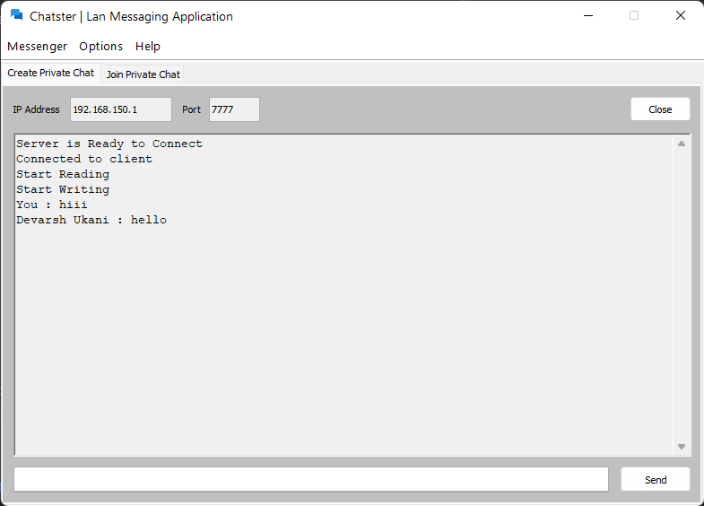

## Chatster - Lan Chat Application

Chatster is a Desktop Lan Chat Application that enables users to interact with each other users.
Users connected to same local network can chat with each other without any internet.

Concepts used : Socket Programming, Swing GUI, AWT, Threading

### Features
- Private Chat
- Settings

### Future Plans
- Group Chat
- File Sharing

### Requirements
Recommended java SDK Version `13` or higher  
Developed and Tested in Java SDK Version `17.0.2`

### Application Preview

### Contributing
Pull requests are welcome.  
For major changes, please open an issue first to discuss what you would like to change.